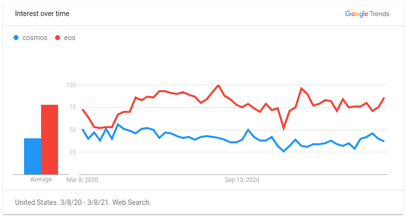

# crypto-review

> cryptos from a developers point of view

### Current Landscape

| Name         | Symbol | Marketcap (USD)   | Rank | Production Ready | &nbsp;Decentralization&nbsp; | &nbsp;&nbsp;&nbsp;Scalabilty&nbsp;&nbsp;&nbsp; | Consensus Algorithm | Sharding | Sidechains         | Developer &nbsp;&nbsp;Community&nbsp;&nbsp; | Transaction Fees       | Turing Complete | Smart Assets | Smart Contracts | dApps | Virtual Machine | Contract Language |
| ------------ | ------ | ----------------- | ---- | ---------------- | ---------------------------- | ---------------------------------------------- | ------------------- | -------- | ------------------ | ------------------------------------------- | ---------------------- | --------------- | ------------ | --------------- | ----- | --------------- | ----------------- |
| Bitcoin      | BTC    | $913,437,031,824  |    1 | Yes              | ★ ★ ★ ★ ★                    | ★ ★ ★ ★                                        | PoW                 | No       | No                 | ★ ★ ★ ★ ★                                   | Yes (Can be Expensive) | No              | No           | No              | N/A   | N/A             | N/A               |
| Ethereum     | ETH    | $190,788,644,118  |    2 | Yes              | ★ ★ ★ ★ ★                    | ★ ★                                            | PoW                 | No       | Partial (offchain) | ★ ★ ★ ★ ★                                   | Yes (Very Expensive)   | Yes             | Yes          | Yes             | 2190  | EVM             | Solidity          |
| Ethereum 2.0 | ETH    | N/A               |  N/A | No               | ★ ★ ★ ★ ★                    | ★ ★ ★ ★ ★                                      | PoS                 | Yes      | Yes                | ★ ★ ★ ★ ★                                   | Yes                    | Yes             | Yes          | Yes             | N/A   | WASM            | Any Language      |
| Cardano      | ADA    | $35,887,731,331   |    4 | No               | ★ ★ ★ ★ ★                    | ★ ★ ★ ★ ★                                      | PoS                 | Yes      | Yes                | ★ ★ ★                                       | Yes                    | Yes             | Yes          | Yes             | N/A   | KEVM IEVM       | Any Language      |
| Polkadot     | DOT    | $30,949,107,442   |    6 | Yes              | ★ ★ ★ ★ ★                    | ★ ★ ★ ★ ★                                      | PoS                 | Yes      | Yes                | ★ ★ ★ ★                                     | Yes                    | Yes             | Yes          | Yes             | 48    | WASM            | Any Language      |
| Nem          | XEM    | $6,567,188,783    |   14 | Yes              | ★ ★ ★ ★ ★                    | ★ ★ ★                                          | PoI                 | No       | No                 | ★ ★ ★                                       | Yes                    | No              | Yes          | No              | N/A   | N/A             | N/A               |
| Cosmos       | ATOM   | $3,981,298,122    |   19 | Yes              | ★ ★ ★ ★ ★                    | ★ ★ ★ ★ ★                                      | PoS                 | Yes      | Yes                | ★ ★ ★ ★                                     | Yes                    | Yes             | Yes          | Yes             | 220   | N/A             | Golang            |
| EOS          | EOS    | $3,659,700,720    |   22 | Yes              | ★ ★ ★                        | ★ ★ ★ ★ ★                                      | dPoS                | Yes      | Yes                | ★ ★ ★ ★ ★                                   | Free                   | Yes             | Yes          | Yes             | 571   | WASM            | Any Language      |
| TRON         | TRON   | $3,657,178,467    |   23 | Yes              | ★ ★ ★                        | ★ ★ ★                                          | dPoS                | No       | No                 | ★ ★ ★ ★                                     | Yes                    | Yes             | Yes          | Yes             | 1205  | TVM             | Solidity          |

## Bitcoin (BTC)

the first crypto currency

[bitcoin.org](https://bitcoin.org)

[whitepaper](https://bitcoin.org/bitcoin.pdf)

[wikipedia](https://en.wikipedia.org/wiki/Bitcoin)

[docs](https://developer.bitcoin.org)

_5 year trend_

#### Pros

- the first cryptocurrency
- most trusted cryptocurrency
- cryptocurrency with the largest market cap
- leader in the cryto space

#### Cons

- PoW algorithm consumes massive amounts of energy
- does not support sharding or sidechains
- cannot build dApps because it does not support smart contracts

#### Additional Links

[coinmarketcap.com/currencies/bitcoin](https://coinmarketcap.com/currencies/bitcoin)

[cryptorival.com/coins/bitcoin](https://cryptorival.com/coins/bitcoin)

## Ethereum (ETH)

the first crypto currency that supports smart contracts

**_ethereum 2.0 is still in active development_**

_1 year trend_

[ethereum.org](https://ethereum.org)

[whitepaper](https://ethereum.org/en/whitepaper)

[wikipedia](https://en.wikipedia.org/wiki/Ethereum)

[docs](https://ethereum.org/en/developers)

#### Pros

- first crypto that support smart contracts
- most active cryto that supports smart contracts
- most funded crypto that supports smart contracts
- smart contract platform with the most dApps
- ethereum 2.0 has the potential to fix slow and expensive transactions and bring support for additional languages due to the EVM being replaced with WASM
- leader in the smart contract space
- largest smart contract developer community
- best development tooling in the space

#### Cons

- slow network
- expensive transaction fees (not an issue in 2.0 due to migration to PoS algorithm)
- PoW algorithm consumes massive amounts of energy (not an issue in 2.0 due to migration to PoS algorithm)
- smart contracts built in an obscure and unfamiliar custom language called solidity (theoretically not an issue in 2.0 due to transition from EVM to WASM)
- current PoW algorithm consumes massive amounts of energy (not an issue in 2.0 due to migration to PoS consensus algorithm)
- does not support sharding (not an issue in 2.0 due to support for both sharding and sidechains)
- ethereum 2.0 is not ready yet

#### Additional Links

[coinmarketcap.com/currencies/ethereum](https://coinmarketcap.com/currencies/ethereum)

[cryptorival.com/coins/ethereum](https://cryptorival.com/coins/ethereum)

[dappradar.com/rankings/protocol/ethereum](https://dappradar.com/rankings/protocol/ethereum)

[dapp.com/topics/ethereum](https://www.dapp.com/topics/ethereum)

## Cardano (ADA**

largest marketcap PoS smart contract platform

**_cardano is still in active development_**

_1 year trend_

[cardano.org](https://cardano.org)

[whitepaper](https://why.cardano.org/en/introduction/motivation)

[wikipedia](https://en.wikipedia.org/wiki/Cardano_(cryptocurrency_platform))

[docs](https://docs.cardano.org)

[roadmap](https://roadmap.cardano.org)

#### Pros

- largest marketcap PoS smart contract platform
- PoS consensus allows the platform to scale efficiently
- KEVM is backwards compatible with ethereum solidity smart contracts
- IEVM virtual machine supports smart contracts to be built in many languages
- supports sharding and sidechains which improves the scalability of the platform

#### Cons

- the crypto still needs to be proven
- there are no published dApps yet
- platform is not ready for smart contracts yet
- development community lacks a lot of resources because it is so new

#### Additional Links

[coinmarketcap.com/currencies/cardano](https://coinmarketcap.com/currencies/cardano)

[cryptorival.com/coins/cardano](https://cryptorival.com/coins/cardano)

## Polkadot (DOT)

largest marketcap production ready PoS smart contract platform

_1 year trend_

[polkadot.network](https://polkadot.network)

[whitepaper](https://polkadot.network/Polkadot-lightpaper.pdf)

[wikipedia](https://en.wikipedia.org/wiki/Polkadot_(cryptocurrency))

[docs](https://wiki.polkadot.network)

#### Pros

- largest marketcap production ready PoS smart contract platform
- PoS consensus allows the platform to scale efficiently
- emphasis on sidechains enabling massive scalability
- WASM virtual machine supports smart contracts to be built in many languages
- supports sharding which improves the scalability of the platform

#### Cons

- more complex architecture due to sidechain emphasis
- small number of published dApps
- development community still lacking because it is newer

#### Additional Links

[coinmarketcap.com/currencies/polkadot](https://coinmarketcap.com/currencies/polkadot)

[cryptorival.com/coins/polkadot](https://cryptorival.com/coins/polkadot)

[dapp.com/topics/polkadot](https://www.dapp.com/topics/polkadot)

## Nem (XEM)

first crypto that supports proof of importance consensus

_1 year trend_

[nem.io](https://nem.io)

[nemplatform.com](https://nemplatform.com)

[whitepaper](https://nemplatform.com/wp-content/uploads/2020/05/NEM_techRef.pdf)

[docs](https://docs.nem.io)

#### Pros

- first crypto that supports proof of importance consensus
- PoI algorithm enables more equitable distribution of value
- supports smart assets
- one of the simplest platforms for building smart assets

#### Cons

- does not support sharding or sidechains
- smart assets are not flexible because it does not support smart contracts
- cannot build dApps because it does not support smart contracts
- community interest has decreased

#### Additional Links

[coinmarketcap.com/currencies/nem](https://coinmarketcap.com/currencies/nem)

[cryptorival.com/coins/nem](https://cryptorival.com/coins/nem)

## Cosmos (ATOM)

first smart contract platform that does not run a virtual machine

_1 year trend_

[cosmos.network](https://cosmos.network)

[whitepaper](https://cosmos.network/resources/whitepaper)

[docs](https://docs.cosmos.network)

#### Pros

- first smart contract platform that does not run a virtual machine
- PoS consensus allows the platform to scale efficiently
- supports sharding and sidechains which improves the scalability of the platform
- over 200 dApps already in production

#### Cons

- smart contracts must be built in golang (could be a pro depending on how to look at it)
- development community still in the process of maturing

#### Additional Links

[coinmarketcap.com/currencies/cosmos](https://coinmarketcap.com/currencies/cosmos)

[cryptorival.com/coins/cosmos](https://cryptorival.com/coins/cosmos)

[cosmos.network/ecosystem/apps](https://cosmos.network/ecosystem/apps)

## EOS (EOS)

most active production ready PoS smart contract platform

_1 year trend_

[eos.io](https://eos.io)

[whitepaper](https://github.com/EOSIO/Documentation/blob/master/TechnicalWhitePaper.md)

[wikipedia](https://en.wikipedia.org/wiki/EOS.IO)

[docs](https://developers.eos.io)

#### Pros

- most active production ready non PoW smart contract platform
- well funded by silicon valley
- free transactions
- dPoS consensus allows the platform to scale efficiently
- WASM virtual machine supports smart contracts to be built in many languages
- supports sharding and sidechains which improves the scalability of the platform
- third largest dApp platform (over 400 dApps already in production)
- one of the best developer communities
- created by the same group who built steemit (one of the most successful dApps and largest decentralized social network)

#### Cons

- 21 block producers makes it a more centralized crypto

#### Additional Links

[coinmarketcap.com/currencies/eos](https://coinmarketcap.com/currencies/eos)

[cryptorival.com/coins/eos](https://cryptorival.com/coins/eos)

[dappradar.com/rankings/protocol/eos](https://dappradar.com/rankings/protocol/eos)

[dapp.com/topics/eos](https://www.dapp.com/topics/eos)

## TRON (TRON)

second most active production ready PoS smart contract platform

_1 year trend_

[tron.network](https://tron.network)

[whitepaper](https://tron.network/static/doc/white_paper_v_2_0.pdf)

[wikipedia](https://en.wikipedia.org/wiki/TRON_(cryptocurrency))

[docs](https://developers.tron.network)

#### Pros

- second most active production ready non PoW smart contract platform
- dPoS consensus allows the platform to scale efficiently
- WASM virtual machine supports smart contracts to be built in many languages
- supports sharding and sidechains which improves the scalability of the platform
- second largest dApp platform (over 1000 dApps already in production)

#### Cons

- 27 block producers makes it a more centralized crypto
- trust issues with their leadership

#### Additional Links

[coinmarketcap.com/currencies/tron](https://coinmarketcap.com/currencies/tron)

[cryptorival.com/coins/tron](https://cryptorival.com/coins/tron)

[dappradar.com/rankings/protocol/tron](https://dappradar.com/rankings/protocol/tron)

[dapp.com/topics/tron](https://www.dapp.com/topics/tron)

## Resources

[coinmarketcap.com](https://coinmarketcap.com) - Cryptos sorted by marketcap

[cryptorival.com](https://cryptorival.com) - Compare crypto currencies

[dappradar.com](https://dappradar.com) - dApp marketplace across crypto platforms

[dapp.com](https://www.dapp.com) - dApp marketplace across crypto platforms

[cardano vs polkadot vs ethereum vs eos vs cosmos](https://www.reddit.com/r/eos/comments/lemel2/cardano_vs_polkadot_vs_ethereum_vs_eos_vs_cosmos) - one of the best comparisons of smart contract (dApp) crypto platforms
